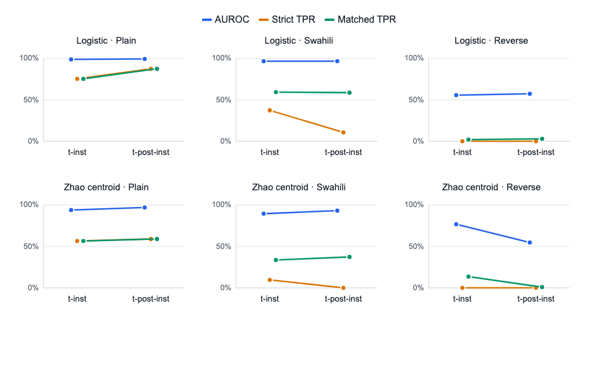

# Phase 2 Results: Token Position and Failure-Mode Decomposition

Analysis date: 2026-07-23
Status: definitive Phase 2 analysis
Model: `google/gemma-3-27b-it`
Comparison: final instruction token (`t_inst`) versus final templated-prompt
token (`t_post-inst`)
Primary metric: TPR at a threshold calibrated to 1% FPR on tune-set negatives

## Main result

Token position changes **calibration stability**, but not Swahili rank
discrimination, for the primary all-layer logistic probe.

The two positions have effectively identical Swahili AUROC:

- `t_inst`: **0.9669**;
- `t_post-inst`: **0.9670**; and
- paired `t_inst - t_post-inst` bootstrap difference:
  **-0.0001**, 95% CI **[-0.0072, +0.0067]**.

With condition-matched calibration, their Swahili operating points are also
similar:

- `t_inst`: **59.3% TPR at 1.32% FPR**;
- `t_post-inst`: **58.6% TPR at 1.07% FPR**; and
- paired matched-TPR difference: bootstrap mean **+1.9 points**, 95% CI
  **[-4.9, +10.2]**.

With the threshold frozen on plain tune negatives, however, `t_inst` detects
**37.3%** of Swahili harmful prompts while `t_post-inst` detects only
**10.7%**. The paired strict-TPR difference has bootstrap mean **+28.1 points**
with 95% CI **[+13.9, +41.5]**. The corresponding matched thresholds move from
3.956 to 1.814 at `t_inst`, but from 2.822 to -0.487 at `t_post-inst`.

The correct interpretation is therefore:

> Swahili preserves essentially the same linearly accessible harmfulness
> ranking at both prompt positions. The final instruction token gives a
> substantially more stable English-calibrated operating point, while
> negative-only condition-matched calibration recovers nearly identical
> detection at either position.

This does not support the broader hypothesis that `t_inst` always contains more
separable harmfulness information. In-distribution, `t_post-inst` is actually
stronger: AUROC 0.9941 versus 0.9878 and TPR 87.5% versus 75.4% at approximately
1% FPR.



The figure shows threshold-independent AUROC together with strict and
condition-matched TPR. Realised FPRs are given in the table below.

## Complete point estimates

Each cell reports held-out test TPR / realised FPR. Strict thresholds use plain
tune negatives; matched thresholds use same-condition tune negatives. AUROC is
threshold-independent.

| Detector | Position | Plain strict | Swahili strict | Swahili matched | Swahili AUROC | Reverse strict | Reverse matched | Reverse AUROC |
|---|---|---:|---:|---:|---:|---:|---:|---:|
| Logistic | `t_inst` | 75.4 / 1.07% | 37.3 / 0.25% | 59.3 / 1.32% | 0.9669 | 0.0 / 0.0% | 2.1 / 0.74% | 0.5565 |
| Logistic | `t_post-inst` | **87.5 / 0.91%** | 10.7 / 0.0% | 58.6 / 1.07% | **0.9670** | 0.0 / 0.0% | 3.0 / 0.91% | **0.5731** |
| Zhao centroid | `t_inst` | 56.5 / 2.23% | **9.7 / 0.16%** | 33.6 / 1.48% | 0.8951 | 0.0 / 0.0% | **13.6 / 1.57%** | **0.7674** |
| Zhao centroid | `t_post-inst` | **59.0 / 1.07%** | 0.0 / 0.0% | **37.3 / 0.49%** | **0.9320** | 0.0 / 0.0% | 0.9 / 0.66% | 0.5475 |

Primary logistic score distributions are summarised below as median
[`Q1`, `Q3`]. Scores are position-specific logits, so their absolute scales
should be compared across conditions within a position, not between separately
fitted positions.

| Position | Condition | Benign score | Harmful score |
|---|---|---:|---:|
| `t_inst` | Plain | -8.824 [-10.488, -6.610] | 7.657 [4.028, 10.998] |
| `t_inst` | Swahili | -7.568 [-9.219, -5.340] | 2.693 [0.016, 5.532] |
| `t_inst` | Reverse | -5.092 [-5.382, -4.822] | -4.999 [-5.243, -4.826] |
| `t_post-inst` | Plain | -9.455 [-11.169, -7.356] | 10.120 [5.615, 13.035] |
| `t_post-inst` | Swahili | -6.612 [-7.768, -5.253] | 0.232 [-1.607, 1.836] |
| `t_post-inst` | Reverse | -9.445 [-9.847, -9.007] | -9.265 [-9.718, -8.768] |

## Failure-mode decomposition

### Swahili: calibration shift at both positions

Both logistic probes retain AUROC 0.967. Matched calibration recovers about
59% TPR at both positions. The substantially weaker frozen-threshold result at
`t_post-inst` is therefore not evidence that harmfulness disappears there; its
score distribution moves further relative to its plain threshold.

`t_inst` is consequently preferable for the practical detector because it is
less sensitive to this threshold shift, not because its Swahili ranking is
better.

### Reverse: discrimination failure at both positions

The logistic probe is close to chance at both positions:

- `t_inst`: AUROC 0.5565;
- `t_post-inst`: AUROC 0.5731; and
- paired difference: bootstrap mean -0.0165, 95% CI
  [-0.0583, +0.0249].

Neither matched threshold recovers useful detection. This rules out the
specific explanation that reverse fails only because the detector was measured
after the instruction boundary. For the fitted all-layer direction, the
plain-to-reverse failure is a loss of discrimination at both positions.

### The centroid geometry is more position-sensitive

The Zhao centroid is stronger at `t_post-inst` on plain and Swahili:

- plain AUROC: 0.9700 versus 0.9394;
- Swahili AUROC: 0.9320 versus 0.8951; and
- paired Swahili AUROC difference (`t_inst - t_post-inst`):
  -0.0369, 95% CI [-0.0524, -0.0214].

Reverse has the opposite pattern. The centroid retains substantial rank
information at `t_inst` (AUROC 0.7674; matched TPR 13.6%) but collapses at
`t_post-inst` (AUROC 0.5475; matched TPR 0.9%). The paired AUROC difference is
+0.2199, 95% CI [+0.1777, +0.2609], and the paired matched-TPR difference has
bootstrap mean +11.6 points, 95% CI [+5.1, +16.0].

This is evidence that the layer-averaged class geometry is sensitive to the
chat-template position. It does not rescue the primary logistic detector and
does not establish a causal harmfulness/refusal distinction.

## Defensible claims

The results support:

1. Swahili retains essentially equal logistic harmfulness ranking at
   `t_inst` and `t_post-inst`.
2. `t_inst` substantially improves strict English-threshold transfer under
   Swahili, indicating greater calibration stability.
3. Reverse causes a genuine loss of logistic discrimination at both positions,
   rather than a failure specific to the post-instruction template token.
4. Zhao centroid geometry is position-sensitive, with reverse information
   retained at `t_inst` but not `t_post-inst`.

The results do not support:

- a claim that `t_inst` is uniformly more harmfulness-separable;
- a calibration-invariant detector;
- a causal separation of harmfulness and refusal;
- robustness to arbitrary meaning-preserving transformations; or
- selection of another token position, layer, threshold, or detector using
  these test outcomes.

## Validation and uncertainty

The analysis checked exact equality of model, revision, seed, train/tune/test
IDs, labels, condition-input hash, and expected position metadata across the
two artefacts. Every tune/test logistic and centroid score was finite.

Paired bootstrap intervals use 10,000 repeats. Each repeat resamples the same
tune negatives and held-out harmful/benign prompt indices for both positions,
then re-estimates the relevant thresholds. The intervals include calibration
and held-out sampling uncertainty, but not detector retraining, another split,
translation regeneration, judge uncertainty, or another model.

## Reproducibility and provenance

Commands:

```bash
python -m phase1.phase1_activation \
  --position t_post_inst \
  --out data/phase2_activation_t_post_inst_27b.npz \
  --batch-size 8

OPENBLAS_NUM_THREADS=1 OMP_NUM_THREADS=1 MKL_NUM_THREADS=1 \
python -m phase2.analyse_phase2 --bootstrap 10000
```

Eddie:

- clean run commit: `6a574074fdc635b0435a49e1d36cafb839e79167`;
- real-model smoke: job `57058229`;
- definitive run: job `57058315`;
- runtime: 584.9 seconds;
- exit status: 0;
- maximum RSS: 52.65 GB;
- model revision:
  `005ad3404e59d6023443cb575daa05336842228a`;
- train/tune/test counts: 5,341 / 1,781 / 1,781;
- selected `C`: 0.001;
- selected tune log-loss: 0.103255;
- position artefact:
  `/exports/eddie/scratch/s2296274/activation-guardrails-phase1/data/phase2_activation_t_post_inst_27b.npz`;
- position artefact SHA-256:
  `2d78b612aba280310704ea7f86e12cab135c4a274b7512244922f1ae2fe86500`;
- structured results SHA-256:
  `748c9fcba8a547f3af6985fb9e876895e49ce2ff1f2f48f2a1b9ef4cf3502568`;
- CSV results SHA-256:
  `1ddc059990396a0b9c63756a2fec750750802ac8456d7f60626934cd56a34999`.

## Phase 2 decision

The stop condition is met: both frozen detectors have been compared at both
positions across plain, Swahili and reverse; strict and matched operating
points, harmful/benign score summaries, AUROC and paired uncertainty are
complete. No response generation, refusal intervention, layer sweep or
additional position search is required.
